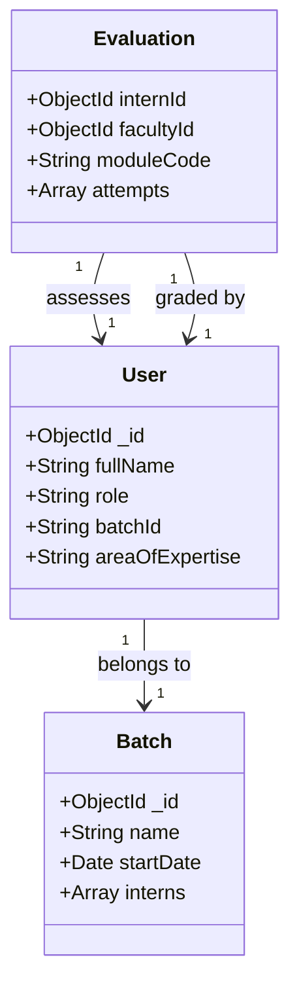

# MS Ophthalmology PG Assessment Tool - Project Report

**Table of Contents**
1. [Problem Definition](#problem-definition)
2. [Root Cause Analysis](#root-cause-analysis)
3. [Proposed Solution](#proposed-solution)
4. [System Architecture](#system-architecture)
5. [Working Principle](#working-principle)
6. [Evaluation Schemas](#evaluation-schemas)
7. [Features & Outcomes](#features--outcomes)
8. [Advantages](#advantages)
9. [Technology Stack](#technology-stack)
10. [Conclusion](#conclusion)
11. [Future Enhancements](#future-enhancements)

---

## 1. Problem Definition <a name="problem-definition"></a>

### The Core Challenge
Postgraduate (PG) medical training in Ophthalmology requires rigorous, continuous assessment across multiple domains: clinical skills (OPD), surgical proficiency (Wet Lab & Live Surgery), and academic knowledge. 

Traditional assessment methods face several critical challenges:
- **Fragmented Data**: Student performance records are often scattered across physical logbooks, Excel sheets, and disconnected systems.
- **Lack of Real-time Feedback**: Feedback is often delayed, reducing its effectiveness for immediate course correction.
- **Inconsistent Grading**: Without standardized digital rubrics, grading can suffer from subjectivity.
- **Administrative Burden**: Compiling long-term performance reports for final university interactions or Department of Health requirements is manual and error-prone.
- **Data Loss**: Physical logbooks can be lost or damaged, leading to a complete loss of training history.

The goal was to create a centralized, digital **PG Assessment Tool** that unifies these disparate assessment streams into a single, intuitive platform for Students, Faculty, and Heads of Department (HOD).

---

## 2. Root Cause Analysis <a name="root-cause-analysis"></a>

Why do current systems fail?

1.  **Manual Processes**: reliance on paper-based "procedure logs" which are difficult to analyze.
2.  **Siloed Information**: Wet lab scores are kept separate from OPD competency checks.
3.  **Authentication Gaps**: Difficulty in verifying *who* actually graded a student and *when*.
4.  **Static Reporting**: Reports are generated only at the end of a term, rather than being available on-demand for continuous monitoring.

---

## 3. Proposed Solution <a name="proposed-solution"></a>

The **SDM Medical Science & Hospital PG Assessment Tool** is a role-based web application designed to digitize the entire assessment lifecycle.

### Key Pillars
1.  **Unified Dashboard**: A single view for PGs to see their progress and for Faculty to see pending evaluations.
2.  **Standardized Modules**: Dedicated workflows for OPD, Wet Lab, Surgery, and Academics.
3.  **Secure Authentication**: Role-based access control (HOD, Faculty, Intern) ensures data integrity.
4.  **Acknowledgment Workflow**: A "maker-checker" system where faculty grade students, but PGs must "acknowledge" the feedback to lock it into their permanent record (or HOD/Faculty finalizes it).

---

## 4. System Architecture <a name="system-architecture"></a>

The system follows a modern **MERN Stack** (MongoDB, Express, React, Node.js) architecture, ensuring scalability and JSON-native data handling which is ideal for complex evaluation forms.

```mermaid
graph TD
    Client[Client Browser] <-->|HTTPS/REST API| LoadBalancer[Load Balancer]
    LoadBalancer <--> Server[Node.js + Express Server]
    
    subgraph "Backend Services"
        Server <--> Auth[Auth Middleware (JWT)]
        Server <--> Controllers[Business Logic Controllers]
        Controllers <--> Models[Mongoose Models]
    end
    
    subgraph "Data Layer"
        Models <--> DB[(MongoDB Database)]
    end
    
    subgraph "External Services"
        Server --> Email[Email Service (NodeMailer)]
    end
```

### Data Flow
1.  **User Action**: Faculty submits a grading form (e.g., Surgery Score).
2.  **API Request**: Frontend sends a POST request with the JSON payload.
3.  **Validation**: Backend validates the schema (scores 0-5, required remarks).
4.  **Persistence**: Data is stored in MongoDB with a `PENDING_ACK` status.
5.  **Notification**: The student sees the new evaluation on their dashboard.
6.  **Finalization**: Student "Acknowledges" the result, changing status to `PERMANENT`.

---

## 5. Working Principle <a name="working-principle"></a>

The application is divided into four primary modules:

### A. OPD (Out Patient Department)
Focuses on clinical diagnostic skills (e.g., Slit Lamp Examination, Refraction).
- **Workflow**: Faculty observes a student → Selects Procedure → Marks competency (Yes/No) for steps → Overall Pass/Fail.
- **Logic**: Simple binary checklist.

### B. Wet Lab
Simulated surgical training.
- **Workflow**: Student performs tasks on eyes in a lab setting.
- **Scoring**: Numeric scores (0-10) for specific parameters (Incision, Sclerosis, etc.).
- **Logic**: Automated calculation of Total Score and Percentage.

### C. Surgery
Live surgical performance assessment.
- **Complexity**: High. Includes pre-op (block, draping) and intra-op steps.
- **Rubric**: 5-point Likert scale (0=Poor to 5=Excellent) for each step.
- **Mandatory Feedback**: If a score < 3 is given, the "Remarks" field becomes mandatory to ensure constructive feedback.

### D. Academics
Seminar and Case selections.
- **Workflow**: Tracks presentation quality, slides, and Q&A handling.
- **Scoring**: 0-10 scale.

---

## 6. Evaluation Schemas <a name="evaluation-schemas"></a>

The database design uses a document-oriented approach. Below are simplified schema representations.



### Schema Structure (JSON)
**OpdEvaluation**:
```json
{
  "internId": "Reference(User)",
  "moduleCode": "OPD_GLAUCOMA",
  "attempts": [
    {
      "attemptDate": "2023-10-27",
      "facultyId": "Reference(User)",
      "answers": [
        { "itemKey": "step_1", "ynValue": "Y" },
        { "itemKey": "step_2", "ynValue": "N", "remark": "Missed angle details" }
      ],
      "result": "FAIL",
      "status": "ACKNOWLEDGED"
    }
  ]
}
```

---

## 7. Features & Outcomes <a name="features--outcomes"></a>

| Feature | Outcome |
| :--- | :--- |
| **Role-Based Dashboards** | Custom views for HOD (Global view), Faculty (Grading view), and Interns (My Progress). |
| **Dynamic Forms** | Forms adapt based on the selected procedure (e.g., Cataract vs. DCR Surgery). |
| **Batch Management** | Admin can create batches of interns, useful for tracking yearly cohorts. |
| **Excel Export** | One-click generation of comprehensive reports for all modules, formatted for university submission. |
| **Security** | JWT (JSON Web Token) authentication and Password encryption (Bcrypt). |

---

## 8. Advantages <a name="advantages"></a>

1.  **Data Integrity**: Immutable records after acknowledgment prevent tampering.
2.  **Accessibility**: Accessible from any device (Desktop, Tablet) within the hospital network.
3.  **Analytics**: HOD can view trends (e.g., "Batch 2024 is weak in Retinoscopy").
4.  **Eco-friendly**: Eliminates the need for thousands of paper log sheets per year.

---

## 9. Technology Stack <a name="technology-stack"></a>

### Frontend
-   **React.js**: For building a dynamic, single-page application (SPA).
-   **Tailwind CSS**: For rapid, responsive, and modern styling.
-   **Framer Motion**: For smooth UI transitions and animations.
-   **Context API**: For global state management (User Auth).

### Backend
-   **Node.js & Express**: High-performance, non-blocking server environment.
-   **MongoDB & Mongoose**: Flexible NoSQL database to handle varying evaluation structures.
-   **JSON Web Tokens (JWT)**: Stateless authentication mechanism.

### DevOps & Tools
-   **Git/GitHub**: Version control.
-   **Vite**: Next-generation frontend build tool.

---

## 10. Conclusion <a name="conclusion"></a>

The **PG Assessment Tool** successfully addresses the "paper-trail" problem of medical training. By digitizing evaluations, it not only secures the data but turns it into actionable insights. The system fosters a culture of transparency and continuous improvement, ensuring that the next generation of Ophthalmologists are trained with precision and care. The implementation of the "Acknowledgment" workflow specifically solves the dispute problem, ensuring both student and teacher agree on the assessment outcome.

---

## 11. Future Enhancements <a name="future-enhancements"></a>

1.  **Mobile App**: A dedicated React Native app for Faculty to grade quickly on mobile devices during rounds.
2.  **OSCE Integration**: Module for Objective Structured Clinical Examination with timer-based stations.
3.  **AI Analytics**: Predictive models to suggest remedial classes for students consistently scoring low in specific sub-modules.
4.  **LMS Integration**: Link assessment results directly to a Learning Management System for suggested reading materials.

---

*Report generated by Antigravity AI Assistant.*
